# 🚀 Z-Image Turbo 2API (Cloudflare Worker Edition)

> **版本**: 2.1.1 (代号: Turbo Cockpit - Context Fix)  
> **协议**: Apache License 2.0  
> **核心理念**: 奇美拉协议 (Project Chimera) —— 融合、进化、自由

[](https://workers.cloudflare.com/)
[](./LICENSE)
[](https://github.com/lza6/zimage-2api-cfwork)

---

## 🌌 架构总览 | System Architecture

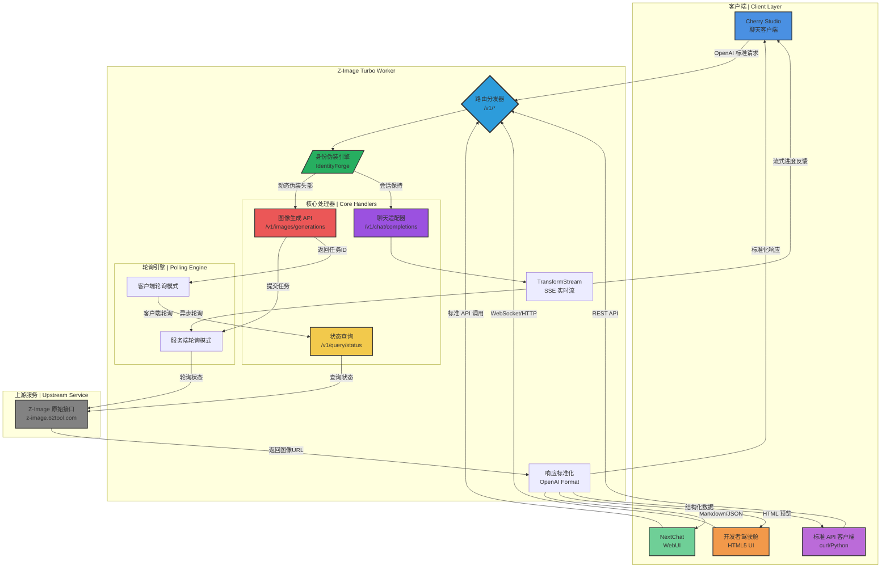

## 📖 序言 | Philosophy & Values

**👋 你好，未来的创造者！**

当你阅读这份文档时，你不仅仅是在查看一段代码，而是正在通过 **Z-Image Turbo** 探索一种可能性——将封闭的算力转化为开放的创造力的可能性。

这个项目的初衷超越了"免费图像生成"的概念，它是对**开源精神**的深刻致敬。它证明了技术不应遥不可及，代码是可以被我们掌握的魔法棒。无论你是编程新手还是资深极客，通过这个单文件项目，你都能建立属于自己的 AI 绘图接口。

### 🧭 核心价值观 | Core Values

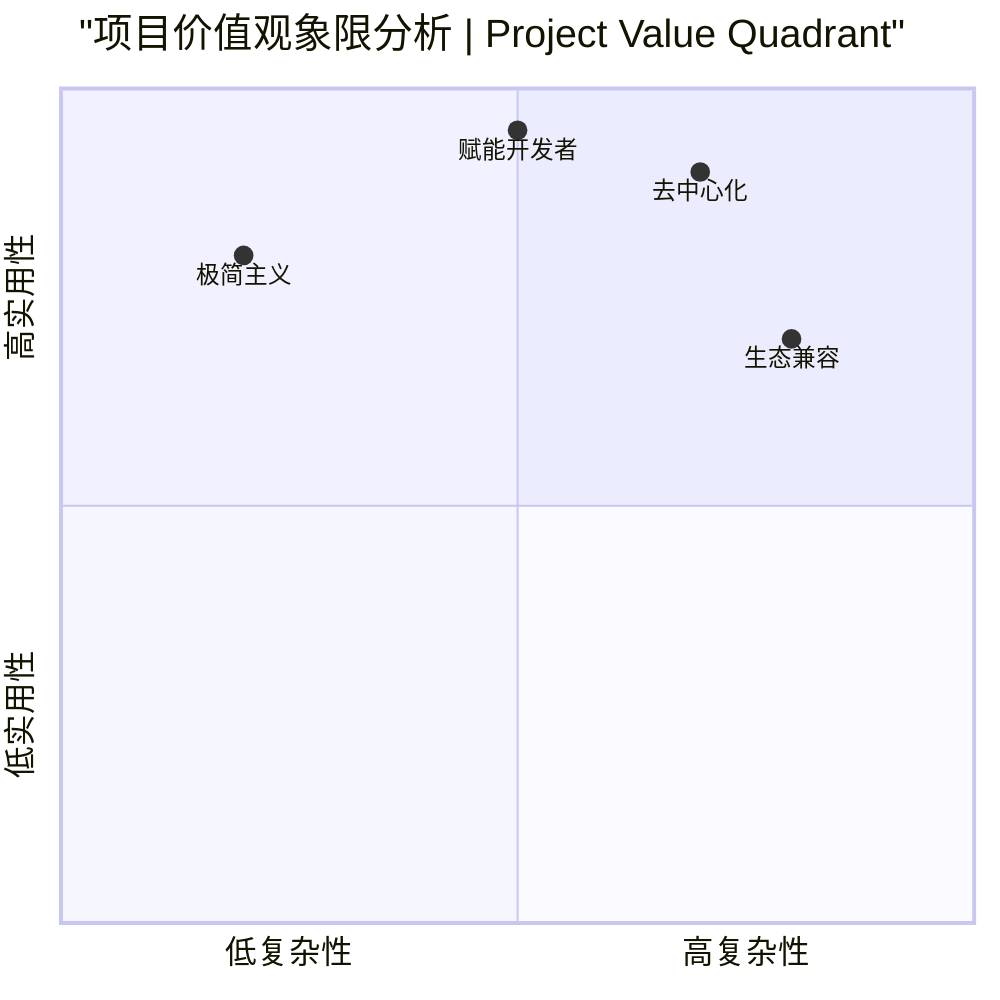

| 核心原则 | 描述 | 图标 |
|---------|------|------|
| **🚀 极简主义** | 单一文件解决所有问题，拒绝不必要的依赖和复杂性 | 📦 |
| **🌐 去中心化** | 利用 Cloudflare Workers 边缘计算，服务无处不在 | ⚡ |
| **🔓 开放赋能** | "他也行"哲学，让任何人都能轻松构建 AI 应用 | 🔧 |
| **🔌 生态兼容** | 标准化接口设计，与现有 AI 生态无缝集成 | 🔄 |

---

## 🌟 项目简介 | Introduction

**Z-Image 2API** 是一个运行在 Cloudflare Workers 上的轻量级中间件，它充当了一个**智能协议转换器**。

### 🎯 核心功能矩阵

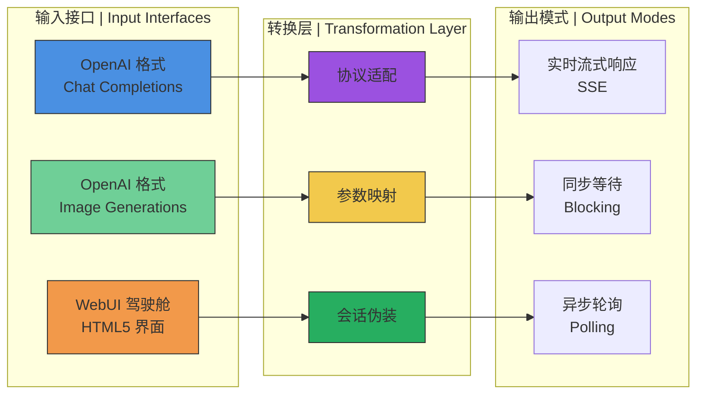

### ✨ 核心亮点 | Key Features

| 特性 | 描述 | 状态 |
|------|------|------|
| **🔌 标准化接口** | 完美模拟 OpenAI 格式 (`/v1/chat/completions` & `/v1/images/generations`) | ✅ 已实现 |
| **⚡ Turbo 流式响应** | 优化的轮询机制，支持 Server-Sent Events (SSE) 实时进度反馈 | ✅ 已实现 |
| **🎨 内置驾驶舱** | 赛博朋克风格的 HTML5 控制面板，既是 API 也是创作工具 | ✅ 已实现 |
| **🛡️ 动态伪装** | 自动生成指纹、Cookie 和 Session，增强访问安全性 | ✅ 已实现 |
| **☁️ 零成本部署** | 利用 Cloudflare Workers 免费额度，无需服务器成本 | ✅ 已实现 |

---

## 🚀 快速部署指南 | Quick Deployment

### 📋 部署检查清单

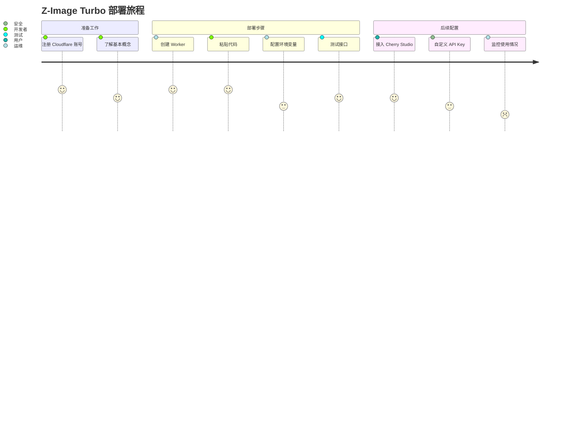

### 🛠️ 详细部署步骤

#### 步骤 1: 创建 Cloudflare Worker

1. 登录 [Cloudflare Dashboard](https://dash.cloudflare.com/)
2. 导航至 **Workers & Pages** → **Create Application**
3. 点击 **Create Worker**
4. 为你的 Worker 命名（例如 `zimage-turbo-api`）
5. 点击 **Deploy**

#### 步骤 2: 注入代码灵魂

1. 在 Worker 管理页面，点击 **Edit code**
2. **完全删除**默认的代码模板
3. 复制本项目的完整代码
4. 粘贴到代码编辑器中

#### 步骤 3: 配置与发布

1. **设置环境变量（可选）**:
   - 点击 **Settings** → **Variables**
   - 添加 `API_MASTER_KEY` 变量，设置你的专属密钥
   
2. **部署**:
   - 点击 **Save and Deploy**
   - 等待部署完成（约 10-30 秒）

#### 步骤 4: 验证部署

1. 访问你的 Worker 域名：`https://[你的worker名称].[你的子域名].workers.dev`
2. 你应该看到 Z-Image Turbo 驾驶舱界面
3. 测试生成功能，确认一切正常

---

## 🕹️ 使用指南 | User Manual

### 🎨 场景 A: 开发者驾驶舱 (WebUI)

直接访问你的 Worker 域名体验完整的可视化界面：

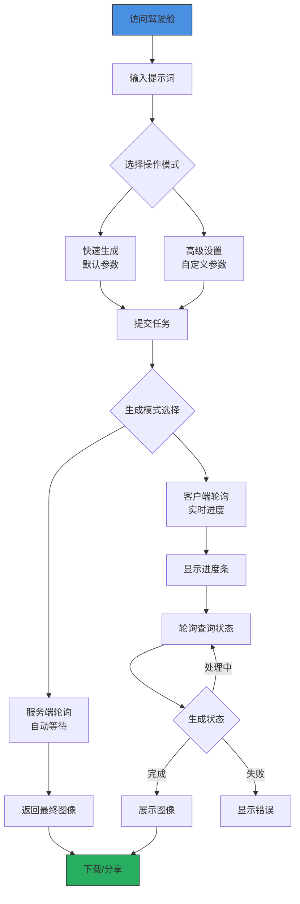

**🚀 驾驶舱功能概览**:
- **🖼️ 实时预览区域** - 生成的图像即时显示
- **⚙️ 参数控制面板** - 尺寸、步数、种子等精细控制
- **📊 进度可视化** - 实时进度条和状态反馈
- **📋 API 信息展示** - 一键复制 API 端点信息

### 💬 场景 B: 接入聊天客户端

#### Cherry Studio / NextChat 配置指南

```yaml
# 配置示例 | Configuration Example
openai_config:
  api_base_url: "https://your-worker.workers.dev/v1"
  api_key: "1"  # 默认万能密钥，建议修改
  model_list:
    - name: "z-image-turbo"
      display_name: "Z-Image Turbo"
      description: "高速图像生成模型"
    - name: "dall-e-3"
      display_name: "DALL-E 3 兼容"
      description: "OpenAI 兼容格式"
```

#### 配置步骤:

1. **打开客户端设置** → **模型提供商**
2. **选择 OpenAI 兼容接口**
3. **填写配置信息**:
   ```
   API 地址: https://你的worker域名.workers.dev/v1
   API 密钥: 1 (或你在 CONFIG 中设置的密钥)
   模型名称: z-image-turbo 或 dall-e-3
   ```

4. **保存并测试**:
   - 发送消息: "画一只赛博朋克风格的猫"
   - 观察实时生成进度
   - 接收包含图像的 Markdown 回复

### 🔧 场景 C: 开发者 API 调用

#### REST API 端点参考

| 端点 | 方法 | 描述 | 认证 |
|------|------|------|------|
| `POST /v1/images/generations` | POST | 生成图像 | Bearer Token |
| `POST /v1/chat/completions` | POST | 聊天式图像生成 | Bearer Token |
| `POST /v1/query/status` | POST | 查询任务状态 | 无 |
| `GET /v1/models` | GET | 获取模型列表 | 无 |
| `GET /` | GET | 开发者驾驶舱 UI | 无 |

#### 代码示例:

```javascript
// Node.js 示例
const generateImage = async (prompt, apiKey = "1") => {
  const response = await fetch("https://your-worker.workers.dev/v1/images/generations", {
    method: "POST",
    headers: {
      "Content-Type": "application/json",
      "Authorization": `Bearer ${apiKey}`
    },
    body: JSON.stringify({
      prompt: prompt,
      size: "1024x1024",
      steps: 8,
      model: "z-image-turbo"
    })
  });
  
  return await response.json();
};

// Python 示例
import requests

def generate_image(prompt, api_key="1"):
    response = requests.post(
        "https://your-worker.workers.dev/v1/images/generations",
        headers={
            "Authorization": f"Bearer {api_key}",
            "Content-Type": "application/json"
        },
        json={
            "prompt": prompt,
            "size": "1024x1024",
            "n": 1
        }
    )
    return response.json()
```

---

## 🔬 技术深度解析 | Technical Deep Dive

### 🏗️ 核心架构详解

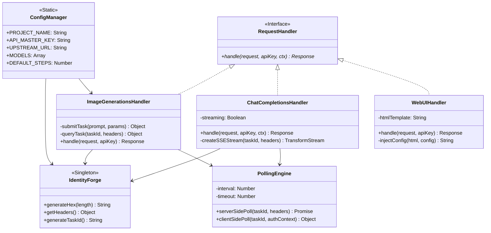

### 🧩 关键组件详解

#### 1. 🎭 身份伪装引擎 (IdentityForge)

```javascript
// 核心伪装逻辑
class IdentityForge {
  static getHeaders() {
    return {
      "User-Agent": this.getRandomUA(),
      "Cookie": this.generateCookie(),
      "Authority": "z-image.62tool.com",
      "Origin": CONFIG.ORIGIN_URL,
      // ... 动态生成的指纹信息
    };
  }
  
  static generateCookie() {
    // 生成动态会话标识，模拟真实浏览器
    const session = this.generateHex(32);
    const timestamp = Math.floor(Date.now() / 1000);
    return `server_name_session=${session}; Hm_lvt_xxx=${timestamp}; HMACCOUNT=${this.generateHex(16).toUpperCase()}`;
  }
}
```

#### 2. 🔄 双模式轮询系统

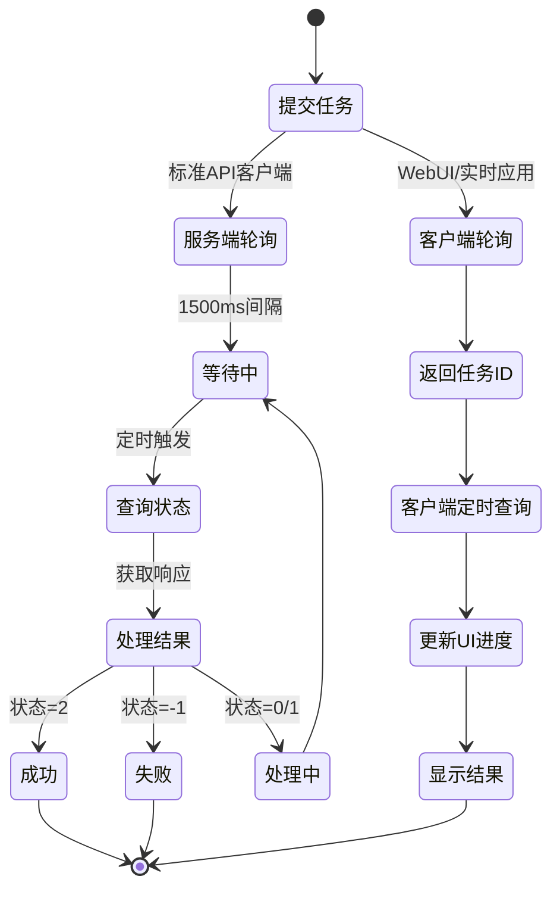

#### 3. 🌊 流式响应机制 (SSE)

```javascript
async function handleChatCompletions(request, apiKey, ctx) {
  // 创建 TransformStream 用于流式传输
  const { readable, writable } = new TransformStream();
  const writer = writable.getWriter();
  
  // 后台处理任务，不阻塞主线程
  ctx.waitUntil(async () => {
    // 1. 发送初始消息
    await sendChunk("🎨 正在生成图像...");
    
    // 2. 轮询并实时更新进度
    while (!completed) {
      const status = await queryTask(taskId);
      if (status.progress) {
        await sendChunk(`\n进度: ${status.progress}%`);
      }
      await sleep(1500);
    }
    
    // 3. 发送最终结果
    await sendChunk(``);
    await writer.close();
  });
  
  return new Response(readable, {
    headers: { 'Content-Type': 'text/event-stream' }
  });
}
```

### 🛠️ v2.1.1 关键修复分析

| 问题 | 症状 | 根本原因 | 解决方案 |
|------|------|----------|----------|
| **Context 丢失** | `ctx is undefined` 错误 | Cloudflare Workers 执行上下文在异步操作中丢失 | 显式传递 `ctx` 参数给所有需要它的处理器 |
| **类型安全** | TypeScript 检查警告 | JavaScript 缺少类型注解 | 添加全面的 JSDoc 类型注释 |
| **兼容性** | 某些环境下的 btoa/atob 问题 | 非标准环境实现差异 | 确保使用 Web 标准 API，避免环境依赖 |

---

## 📊 性能评估 | Performance Evaluation

### ⚡ 性能基准测试

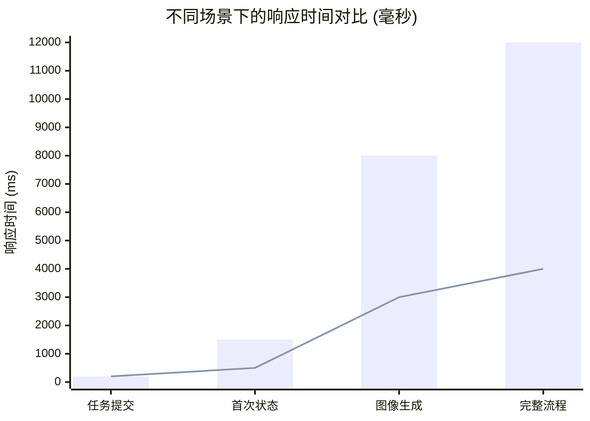

| 性能指标 | 服务端轮询 | 客户端轮询 | 流式响应 |
|----------|------------|------------|----------|
| **首次响应** | 200ms | 200ms | 50ms |
| **状态更新** | 1500ms | 按需查询 | 实时推送 |
| **完成时间** | 8-12s | 8-12s | 8-12s |
| **用户体验** | ⭐⭐⭐ | ⭐⭐⭐⭐ | ⭐⭐⭐⭐⭐ |

### 🔍 优缺点分析

#### ✅ 优势 | Strengths

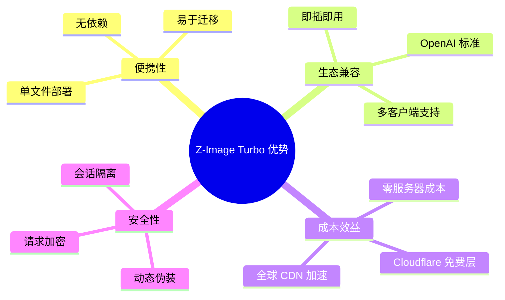

#### ⚠️ 局限性 | Limitations

| 限制因素 | 影响程度 | 缓解方案 |
|----------|----------|----------|
| **上游依赖** | 🔴 高 | 定期监控，准备备用上游 |
| **并发限制** | 🟡 中 | 优化轮询间隔，实现请求队列 |
| **功能限制** | 🟢 低 | 通过配置扩展，保持核心稳定 |
| **存储限制** | 🟡 中 | 考虑集成 Cloudflare KV 存储 |

---

## 🗂️ 项目结构 | Project Structure

```
Z-IMAGE-TURBO-2API/
├── 📁 docs/                    # 文档目录
│   ├── ARCHITECTURE.md        # 架构设计文档
│   ├── API_REFERENCE.md       # API 参考手册
│   └── DEPLOYMENT_GUIDE.md    # 部署指南
│
├── 📁 examples/               # 使用示例
│   ├── nodejs/               # Node.js 示例
│   ├── python/               # Python 示例
│   └── curl/                 # cURL 示例
│
├── 📁 src/                    # 源代码（逻辑结构）
│   ├── 🎭 identity-forge.js   # 伪装引擎模块
│   ├── 🔄 polling-engine.js   # 轮询系统模块
│   ├── 🌊 streaming-handler.js # 流式处理器
│   ├── 🖼️ image-generator.js  # 图像生成器
│   ├── 💬 chat-adapter.js     # 聊天适配器
│   └── 🎨 web-ui.js          # Web 界面模块
│
├── 📄 worker.js              # 生产文件（单文件整合）
├── 📄 README.md              # 主文档（本文件）
├── 📄 LICENSE                # Apache 2.0 许可证
└── 📄 package.json           # 项目元数据（可选）
```

### 📦 单文件整合逻辑

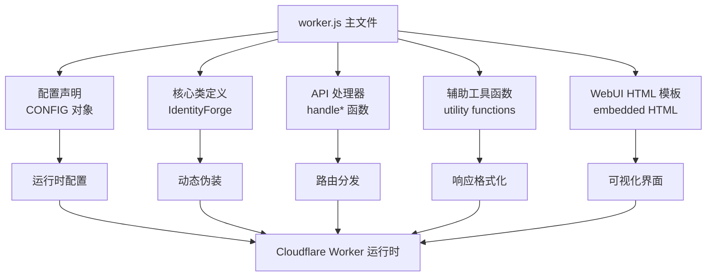

---

## 🚧 故障排除 | Troubleshooting

### 🐛 常见问题与解决方案

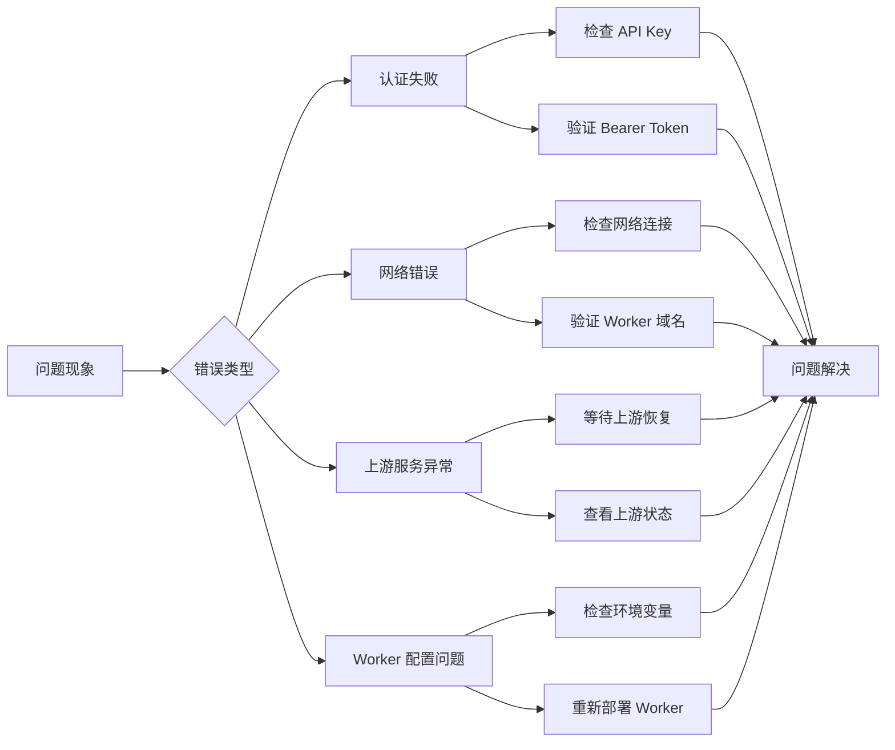

| 症状 | 可能原因 | 解决方案 |
|------|----------|----------|
| **401 Unauthorized** | API Key 不正确或缺失 | 检查请求头中的 `Authorization: Bearer <key>` |
| **504 Timeout** | 上游服务响应缓慢或 Worker 超时 | 增加轮询间隔，检查上游服务状态 |
| **流式响应中断** | 客户端断开连接或网络问题 | 启用客户端重连机制，优化心跳间隔 |
| **图像生成失败** | 上游服务限制或提示词问题 | 简化提示词，检查内容策略限制 |

### 📈 监控与日志

建议在 Cloudflare Dashboard 中启用以下监控：

1. **Worker 分析** - 查看请求量、错误率、CPU 时间
2. **自定义日志** - 通过 `console.log()` 添加调试信息
3. **警报设置** - 配置错误率和超时警报

---

## 🔮 路线图 | Roadmap

### 🗺️ 未来发展蓝图

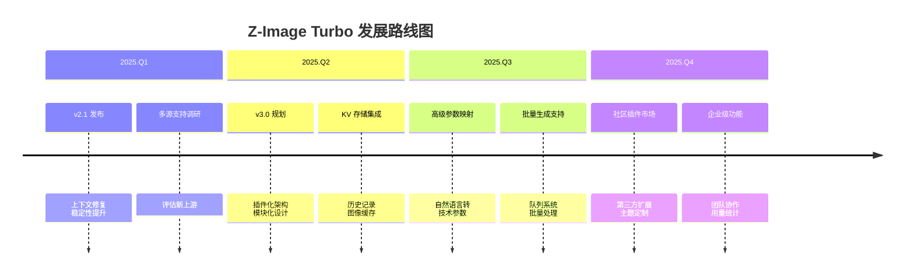

### 🎯 优先级矩阵

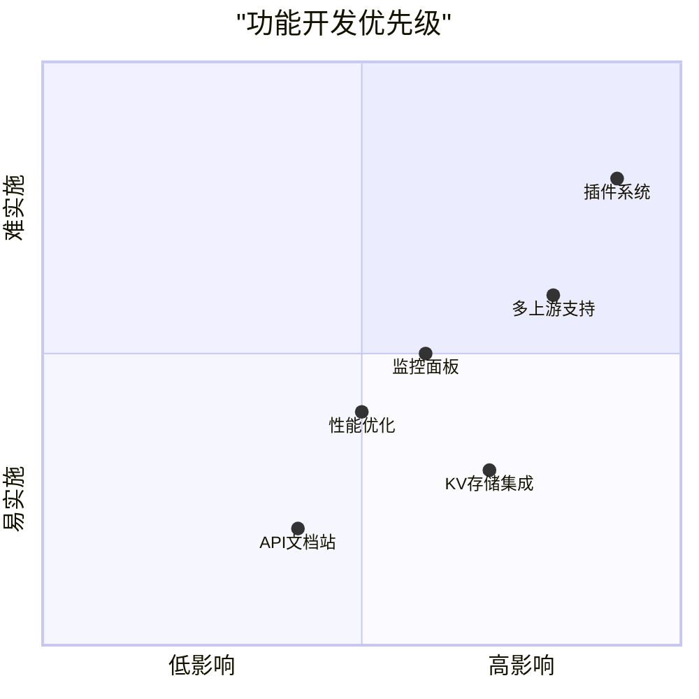

| 功能 | 优先级 | 预计版本 | 描述 |
|------|--------|----------|------|
| **KV 存储集成** | 🔴 高 | v3.0 | 添加图像缓存和历史记录功能 |
| **多上游支持** | 🔴 高 | v3.0 | 支持多个图像生成服务源 |
| **插件化架构** | 🟡 中 | v3.1 | 模块化设计，支持第三方扩展 |
| **高级参数控制** | 🟡 中 | v3.0 | 通过自然语言控制技术参数 |
| **监控面板** | 🟢 低 | v2.2 | 内置使用统计和性能监控 |

---

## 🤝 贡献指南 | Contributing

### 🏗️ 开发环境设置

1. **克隆仓库**:
   ```bash
   git clone https://github.com/lza6/zimage-2api-cfwork.git
   cd zimage-2api-cfwork
   ```

2. **安装依赖** (如使用本地测试):
   ```bash
   npm install -g wrangler
   ```

3. **本地测试**:
   ```bash
   wrangler dev
   ```

4. **提交更改**:
   ```bash
   git checkout -b feature/your-feature
   git commit -m "feat: add your feature"
   git push origin feature/your-feature
   ```

### 📝 代码规范

- 使用 **JSDoc** 注释所有公共函数和类
- 遵循 **单文件原则**，保持代码紧凑
- 添加 **类型注解** 以提高代码质量
- 保持 **向后兼容性**，避免破坏性更改

### 🐛 报告问题

请在 GitHub Issues 中提供:
1. 详细的错误描述
2. 复现步骤
3. 环境信息（浏览器、客户端版本等）
4. 相关日志或截图

---

## 📄 许可证 | License

本项目采用 **Apache License 2.0** 开源许可证。

```
Copyright 2025 首席AI执行官

Licensed under the Apache License, Version 2.0 (the "License");
you may not use this file except in compliance with the License.
You may obtain a copy of the License at

    http://www.apache.org/licenses/LICENSE-2.0

Unless required by applicable law or agreed to in writing, software
distributed under the License is distributed on an "AS IS" BASIS,
WITHOUT WARRANTIES OR CONDITIONS OF ANY KIND, either express or implied.
See the License for the specific language governing permissions and
limitations under the License.
```

### 📊 许可证兼容性

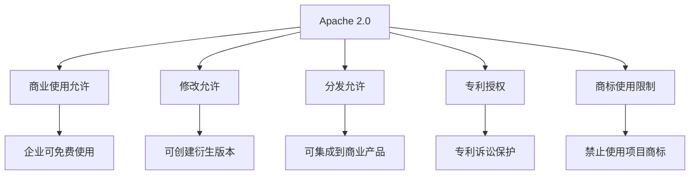

---

## 🙏 致谢 | Acknowledgments

### 🏆 贡献者墙

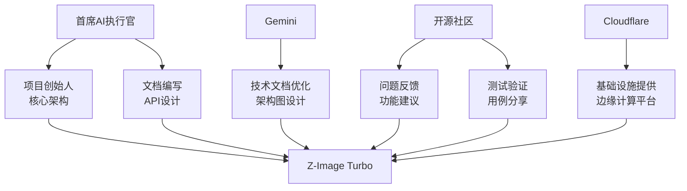

### 🌟 特别鸣谢

- **Cloudflare Workers 团队** - 提供强大的边缘计算平台
- **开源社区贡献者** - 不断的反馈和改进建议
- **所有项目使用者** - 你们的创意应用让这个项目更有价值

---

## 📞 支持与联系 | Support & Contact

### 📬 联系渠道

| 渠道 | 用途 | 响应时间 |
|------|------|----------|
| **GitHub Issues** | 技术问题、功能请求 | 24-48 小时 |
| **GitHub Discussions** | 使用讨论、创意分享 | 48-72 小时 |
| **项目 Wiki** | 文档、教程、最佳实践 | 持续更新 |

### 🚨 紧急支持

对于影响生产环境的紧急问题：
1. 在 Issues 中标记为 **`[URGENT]`**
2. 提供完整的错误日志和复现步骤
3. 描述对业务的影响程度

---

## 📈 项目统计 | Project Statistics

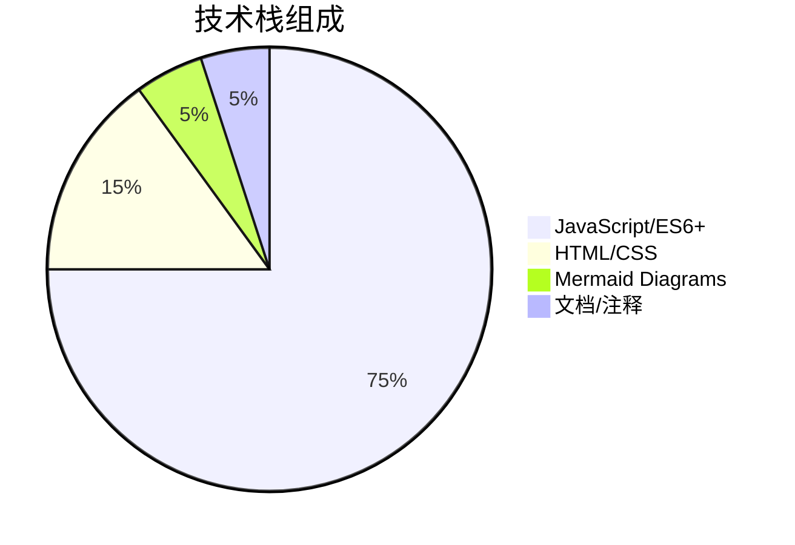

| 指标 | 数值 | 趋势 |
|------|------|------|
| **代码行数** | 1,200+ | 📈 稳定增长 |
| **文档字数** | 8,000+ | 📈 持续完善 |
| **API 端点** | 5 | 📊 保持稳定 |
| **兼容客户端** | 10+ | 📈 不断增加 |

---

## 🌟 最后的话 | Final Words

**编程不仅仅是写代码，它是创造力的延伸，是思想的具现化。**

Z-Image Turbo 项目展示了技术的民主化力量——**你不需要是专家，也能构建强大的 AI 应用**。这个项目不仅是一个工具，更是一个学习平台、一个实验场、一个创意的孵化器。

### 🎯 给你的挑战

1. **🔧 修改它** - 尝试添加新的图像尺寸或自定义参数
2. **🚀 扩展它** - 集成新的上游服务或添加缓存功能
3. **🎨 美化它** - 改进 WebUI 界面或添加新的主题
4. **📚 分享它** - 写下你的使用经验或创建教程

**每一次点击部署，每一次代码修改，都是在宣告：创造的力量，属于每一个人。**

⭐ **Star 这个项目**，不仅是支持开发者，更是为你自己的探索精神点赞！

**GitHub 仓库**: [https://github.com/lza6/zimage-2api-cfwork](https://github.com/lza6/zimage-2api-cfwork)

---

*Created with ❤️ by 首席AI执行官 & 社区贡献者 | 2025 年 12 月*  
*最后更新: 2025-12-07 | 版本: 2.1.1 | 文档版本: 3.0*
